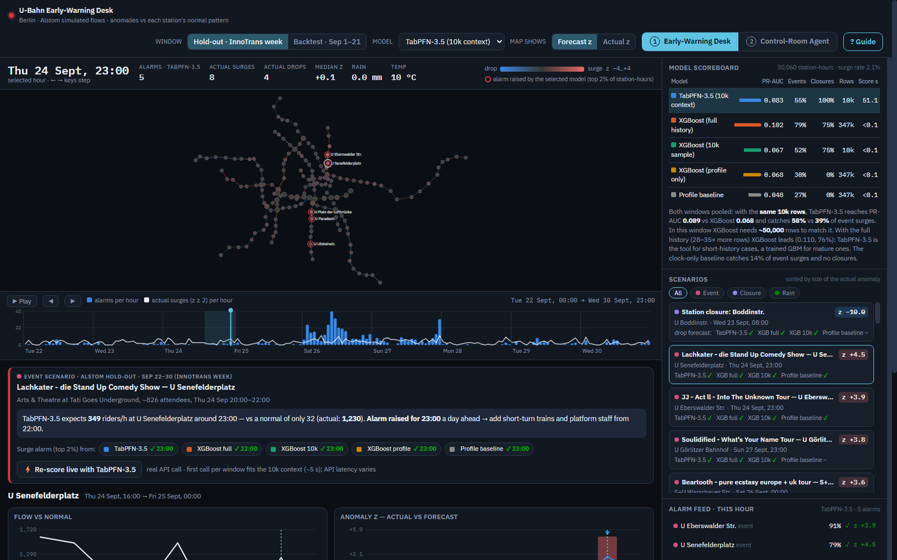
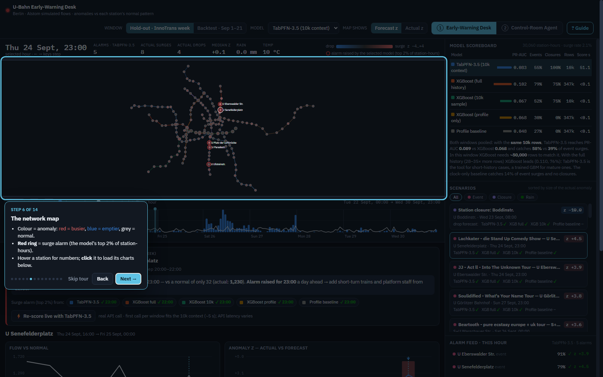
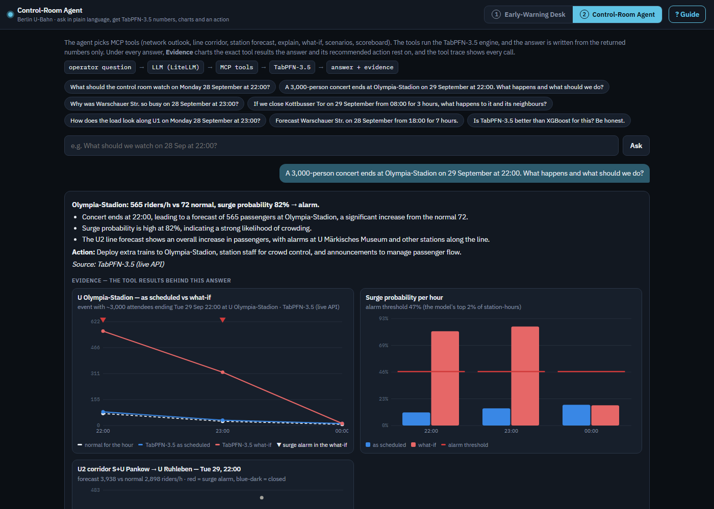
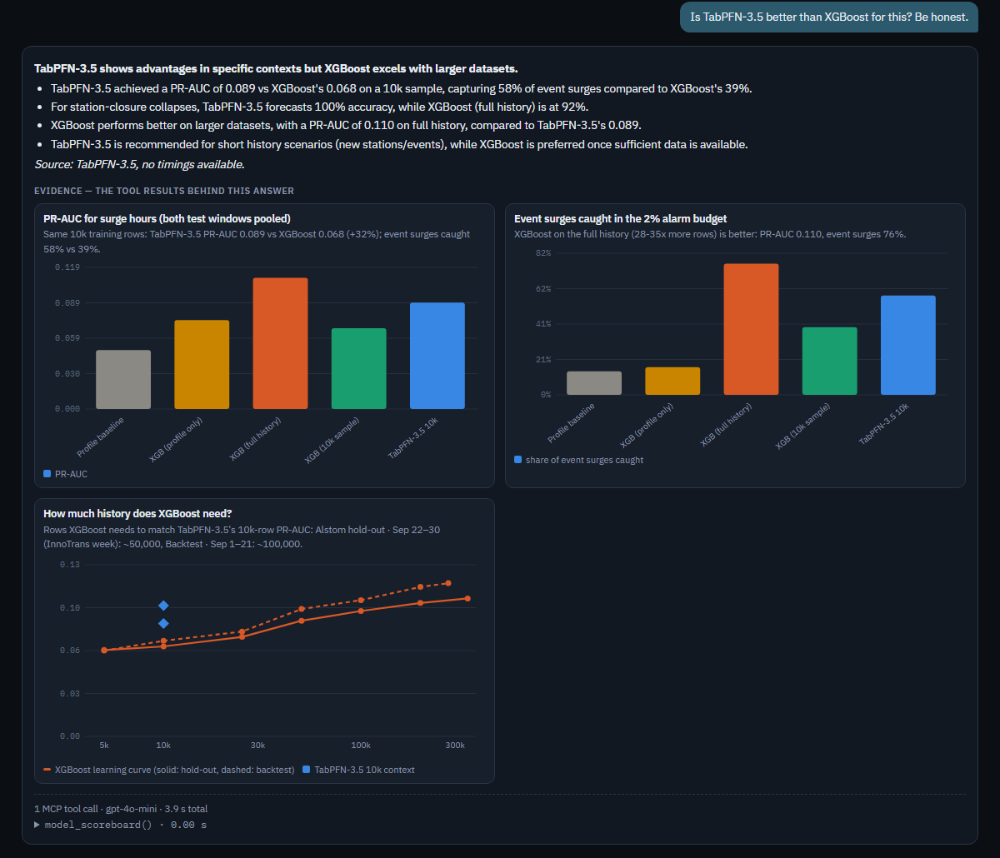
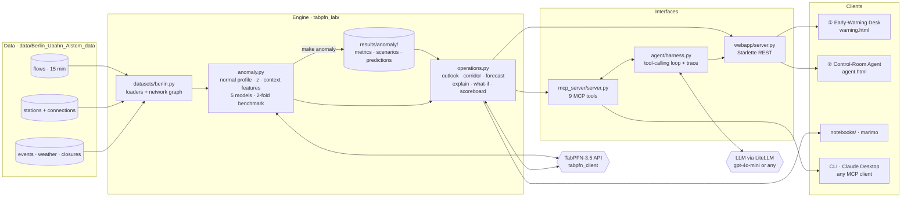
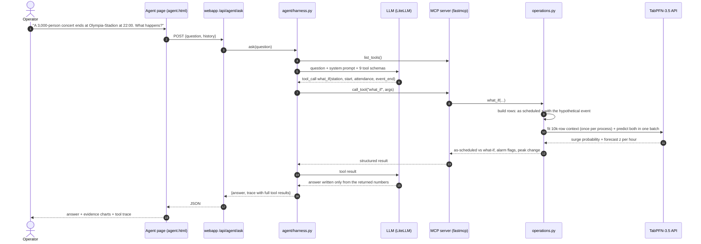
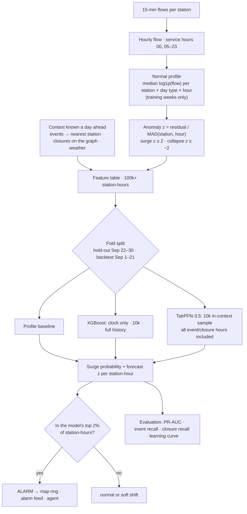

# NextMove-TabPFN — U-Bahn Early-Warning Desk

**TabPFN-3.5 forecasts when Berlin U-Bahn stations will run off their normal pattern, and an LLM agent
turns those forecasts into control-room answers over MCP, with charts as evidence.**
Built for the [TabPFN-3.5 hackathon](https://platform.priorlabs.ai/hackathon-3.5) on the Alstom /
InnoTrans 2026 Berlin U-Bahn dataset (168 stations, 8 lines).



> *The same way an agent hands over to a weather tool for a temperature, it should hand over to a
> specialised model for predictions.* This repo is that hand-off, end to end: operator question → LLM →
> MCP tool → TabPFN-3.5 → numbers + charts → recommended action.

**Contents:** [Try it in 3 minutes](#try-it-in-3-minutes) · [The UI](#the-ui) ·
[The use case](#the-use-case-forecast-the-anomaly-not-the-clock) · [Results](#results) ·
[System design](#system-design) · [MCP tools](#mcp-tools) · [Notebooks](#notebooks) ·
[Repository layout](#repository-layout) · [Data & license](#data-and-license)

---

## Try it in 3 minutes

```bash
git clone <this-repo-url> && cd nextmove-tabpfn
make install                 # venv + requirements
cp .env.example .env         # TABPFN_API_TOKEN (free: https://platform.priorlabs.ai/account/api-keys)
                             # AGENT_LITELLM_MODEL + its key (default gpt-4o-mini / OPENAI_API_KEY)
make app                     # → http://127.0.0.1:8000
```

1. **http://127.0.0.1:8000** opens the **Early-Warning Desk**. A guided walkthrough pops up on the first
   visit; reopen it any time with **? Guide** (top right).
2. Click a **scenario** on the right (e.g. a concert), scrub the **timeline**, and press **⚡ Re-score
   live** for a real TabPFN-3.5 call.
3. Open **② Control-Room Agent** (top tab) and press a preset question. The answer comes with evidence
   charts and the full MCP tool trace.

`results/anomaly/` is committed, so everything works right away. `make anomaly` recomputes it (live
TabPFN-3.5, ~4 min); `make anomaly-offline` skips the API (~30 s). Without a TabPFN token, the live tools
fall back to XGBoost and say so. `make test` runs 15 tests with no API calls; `make help` lists every target.

Demo links: `/?tour=1` starts the desk walkthrough, `/agent?q=<question>` asks the agent on load.

---

## The UI

Two pages, switched with the tabs at the top. Each page has its own **? Guide** walkthrough.

### ① Early-Warning Desk (`/`) — the network, hour by hour

| Area | What it shows | How to use it |
| --- | --- | --- |
| **Top bar** | Test window (Alstom hold-out / backtest), model, forecast-vs-actual switch | Every panel follows these three choices |
| **Network map** | 168 stations coloured by anomaly z (red = busier than normal, blue = emptier); **red ring** = surge alarm (the model's top 2% of station-hours) | Hover for numbers; click a station to load its charts |
| **Timeline** | Alarms per hour (bars) vs surges that really happened (line) | Click or drag, ▶ Play, ← → keys |
| **Model scoreboard** | PR-AUC, event surges caught, closures forecast, rows used, scoring time, per window | Click a row to switch the model |
| **Scenarios** | Real concerts, closures and rain spells, ranked by how unusual they were; ✓ = which models raised the alarm | Click one: map, timeline and charts jump to it |
| **Scenario card** | Cause, the forecast in words, a suggested **action**, each model's verdict | **⚡ Re-score live** makes a real TabPFN-3.5 API call (dashed line) |
| **Station charts** | Flow vs normal vs forecast; actual z vs each model's forecast z, with ▼ alarm marks | Hover for values; click a point to jump to that hour |
| **Line corridor** | Every station of a line in running order: forecast load vs normal for the selected hour | Pick a line; scrub the timeline to watch load move along it |
| **Alarm feed** | This hour's alarms, their drivers and the real outcome (✓) | Click to open the station |



### ② Control-Room Agent (`/agent`) — ask in plain language

The LLM picks MCP tools, the tools run the TabPFN-3.5 engine, and the answer may only use numbers the tools
returned. Every answer has three parts:

1. **The answer**: a bold forecast headline, the drivers and what was observed, an **Action**, and the source.
2. **Evidence**: charts drawn from the exact tool results behind the answer (what-if before/after with the
   alarm threshold, neighbour impact, load per line, the corridor profile, every model vs normal vs
   observed, the learning curve).
3. **Tool trace**: every MCP call with its arguments, latency and raw result.



<details><summary>More: the honest model-comparison answer</summary>


</details>

The agent also runs in the terminal (`make agent`) and inside notebook `02`. The MCP server works with any
MCP client (`make mcp`, stdio). For example, in Claude Desktop:

```json
{ "mcpServers": { "tabpfn-ubahn": {
    "command": "/absolute/path/to/repo/.venv/bin/python",
    "args": ["/absolute/path/to/repo/mcp_server/server.py"] } } }
```

---

## The use case: forecast the anomaly, not the clock

Raw passenger flow is mostly the daily and weekly rhythm: over 80% of hourly variance is explained by a
station × day type × hour profile alone. A model asked "will this station be above its own p90?" learns
that clock, and so does a lookup table: they tie (notebook `01`, ROC-AUC 0.855 vs 0.853). An operator
doesn't need a model to know that 08:00 is busy. They need to know when 08:00 will be **busier, or
emptier, than a normal 08:00**, and why, early enough to act.

1. **Normalise.** Hourly flow per station; the robust normal is the median of `log1p(flow)` per station ×
   day type × hour, from training weeks only. Anomaly score `z = residual / MAD(station, hour)`.
   Surge = `z ≥ 2`, collapse = `z ≤ −2`.
2. **Attribute.** Context known a day ahead:
   - events mapped to their nearest U-Bahn station (a curated venue map; 442 of 457 events mapped, ticket tiers deduplicated)
   - planned closures resolved on the network graph (a line suspension closes every station on the segment)
   - weather
   - station descriptors
3. **Forecast with TabPFN-3.5.** `TabPFNClassifier` gives the surge probability and `TabPFNRegressor` the
   expected z, so expected passengers = normal × e^(z·spread). Both use a 10k-row in-context sample that
   contains every event and closure hour. No training loop, no tuning.
4. **Compare honestly** against four baselines on two expanding-window folds:
   - Alstom's own hold-out (`*_rest` files, Sep 22–30, the InnoTrans week)
   - a Sep 1–21 backtest

   The alarm rule is each model's top 2% of station-hours.
5. **Read it across the network.** Station forecasts are aggregated per line and laid out in running order
   (the **line corridor**), so you see where along a line the load builds or collapses.

## Results

`make anomaly`, both folds pooled, 100,200 test station-hours, surge rate 2.1%:

| Model | Training rows | PR-AUC (surge) | Event surges caught | Station closures forecast |
| --- | --- | --- | --- | --- |
| Profile baseline (clock only) | all | 0.049 | 14% | 0% |
| XGBoost, clock features only | all | 0.074 | 16% | 0% |
| XGBoost, context | 10k (same rows as TabPFN) | 0.068 | 39% | 92% |
| **TabPFN-3.5, context** | **10k in-context** | **0.089** | **58%** | **100%** |
| XGBoost, context | 277k–347k (full history) | 0.110 | 76% | 92% |

- **Context makes early warning possible.** Clock-only models never forecast a closure collapse and miss
  most event surges.
- **At equal data, TabPFN-3.5 wins clearly:** +31% PR-AUC and about 1.5× the event surges caught. XGBoost's
  learning curve needs **~50k (hold-out) to ~100k (backtest) rows, 5–10× more**, to match TabPFN-3.5's
  10k-row context.
- **With the full history (28–35× more rows), XGBoost is better.** TabPFN-3.5 is the engine for short-history
  situations: a new station, venue or rebuilt line, or a new question that needs an answer today without a
  training pipeline. A trained GBM fits once months of clean labels exist. Both run on the same feature table.
- **Latency:** TabPFN-3.5 fits in ~5 s and scores about 1–2 s per 1,000 station-hours over the API, with
  occasional spikes. That's fine for day-ahead or hour-ahead plans (168 stations × 20 h ≈ 3,400 rows).
- **Limits of the data:** flows and closures are simulated. Most |z| ≥ 2 hours have no known driver (noise),
  which caps precision for every model. Line suspensions barely move flow, and there is no spill-over to
  neighbouring stations; a real network would show both.

**Supporting evidence on real data** (`make train-db`): on Deutsche Bahn delays
([piebro/deutsche-bahn-data](https://huggingface.co/datasets/piebro/deutsche-bahn-data), CC BY 4.0,
June 2025, 1.5M stops), TabPFN-3.5 with 10k rows reaches ROC-AUC 0.734 vs 0.751 and MAE **4.64** vs 4.66 min
for XGBoost trained on ~1.2M rows.

---

## System design

### Components



### What happens when an operator asks a question



### From raw CSVs to an alarm



---

## MCP tools

| Tool | Answers | TabPFN-3.5 |
| --- | --- | --- |
| `describe_network` | coverage, valid timestamps, models | — |
| `resolve_station` | "Kotti", "Alex" → exact station names | — |
| `network_outlook` | what to watch at an hour: alarms + drivers, load vs normal per line | precomputed day-ahead run |
| `line_corridor` | forecast load along one line, terminus to terminus | precomputed day-ahead run |
| `station_forecast` | one station hour by hour vs XGBoost and the observed outcome | **live** |
| `explain_anomaly` | why a station-hour was off pattern: drivers, all models, station history | precomputed day-ahead run |
| `what_if` | hypothetical event, closure (neighbours scored too) or rain, vs as scheduled | **live** |
| `list_scenarios` | real incidents and which models flagged them | precomputed day-ahead run |
| `model_scoreboard` | honest benchmark, key findings, learning curve | — |

## Notebooks

`make notebooks` (marimo, reactive, plain `.py`):
`00` data quality & EDA · `01` why the p90 target fails (the motivation) · `02` **anomaly early warning**:
oscillation → normalisation → drivers → model comparison and learning curve → scenario replay → alarm feed →
network outlook and line corridor → live what-if → the agent. Live API cells sit behind buttons.

## Repository layout

```
data/Berlin_Ubahn_Alstom_data/      Alstom/InnoTrans 2026 dataset (committed) — see data/SOURCE.md
tabpfn_lab/
  datasets/berlin.py                loaders: flows, stations, graph, events, weather, closures
  anomaly.py                        normal profile + z, context features, models, 2-fold benchmark
  operations.py                     operator queries: outlook, corridor, forecast, explain, what-if
  datasets/deutsche_bahn.py, evaluate_db.py, xgboost_baseline.py   supporting DB benchmark
mcp_server/server.py                FastMCP: the engine as 9 tools
agent/harness.py, cli.py            LiteLLM tool-calling loop over the MCP server, with trace
webapp/server.py                    Starlette, no build step
webapp/static/warning.html          ① Early-Warning Desk        webapp/static/agent.html   ② Control-Room Agent
webapp/static/tour.js               guided walkthrough shared by both pages
notebooks/00, 01, 02                marimo: EDA · why p90 fails · anomaly early warning
scripts/run_anomaly_benchmark.py    make anomaly → results/anomaly/
tests/                              engine, operations, MCP tool surface (no API calls)
docs/img/                           screenshots used in this README
```

## Where this came from

This project grew out of **[NextMove](https://github.com/mralioo/NextMove)**, a multi-agent "AI team for the
control room" built for the InnoTrans 2026 hackathon on the same dataset, where TabPFN v3.5 was one tool
among many. This repo goes deep on that one thread: TabPFN-3.5 as the prediction engine behind an MCP tool
surface, a small, transparent agent and an operator UI.

## Data and license

`data/Berlin_Ubahn_Alstom_data/` was generated by **Alstom's data team** for the InnoTrans 2026 hackathon and
is reused unmodified. Provenance and schema: [`data/SOURCE.md`](data/SOURCE.md),
[`dataset_schema.md`](data/Berlin_Ubahn_Alstom_data/dataset_schema.md). Deutsche Bahn data is fetched on
demand from Hugging Face. Code: Apache License 2.0 ([`LICENSE`](LICENSE)).
